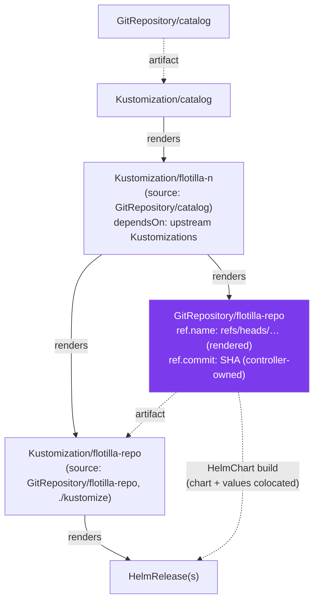
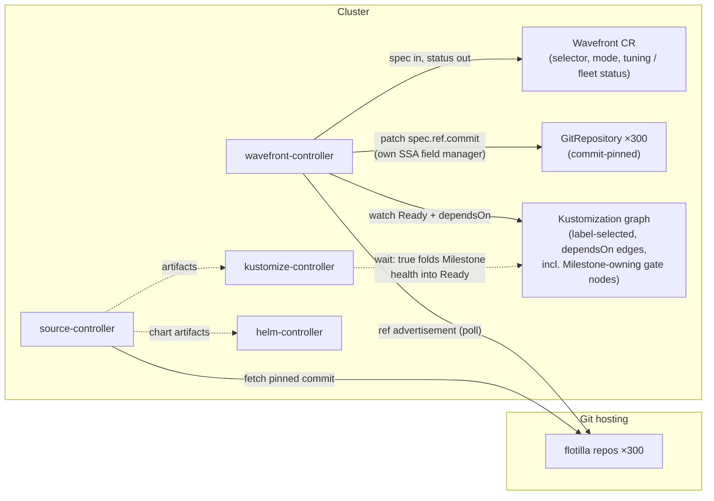
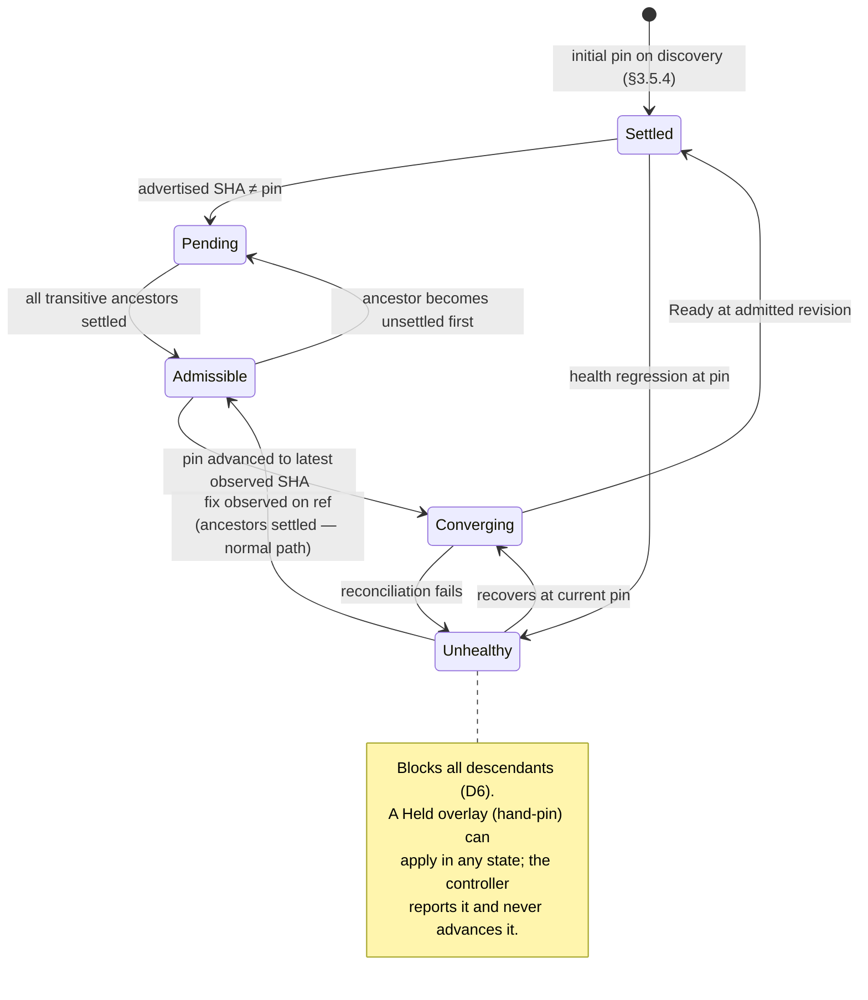

# Wavefront Controller — High-Level Design

**Status:** Proposed (v4.1)
**Date:** 2026-08-27
**Scope:** Sequenced admission of flotilla source updates across ~300 team-owned flotillas, for both piecemeal and en-masse (demo / air-gapped) releases.
**v4.1:** group fixed to `wavefront.as-code.io`; participation label extended to flotilla `GitRepository`s as the managed-source marker (§8.2); toolchain (kubebuilder) and Flux SDK facts verified against current releases (§7).

---

## 1. Summary

Flux's `dependsOn` gates the *apply* of manifests but not *source artifact propagation*. Each flotilla's `HelmRelease`s resolve chart + values from the flotilla's own `GitRepository` at a floating ref, so a repository update reaches helm-controller the moment source-controller produces a new artifact — bypassing all sequencing built on `Kustomization` dependencies and `Milestone`s.

The **Wavefront Controller** closes this gap by owning `spec.ref.commit` on matched flotilla `GitRepository`s. The catalog renders each source with its floating tracking ref (`spec.ref.name`) only; the controller adds and advances a commit pin under its own SSA field manager. Flux's ref precedence guarantees the pin is authoritative regardless of tracking-ref style — `commit` takes precedence over `name`, `semver`, `tag`, and `branch` — so sources reconcile continuously and healthily at all times, but only ever at their pinned revision. **Admission = pin advancement.**

Sequencing order is not declared to the controller — it is **discovered**. The controller label-selects the fleet's `Kustomization`s and derives a dependency DAG from their `spec.dependsOn` edges (D11); each node's `GitRepository` is resolved through its `sourceRef` (D12). Over this graph the controller runs **rolling admission** (D9): it polls each repo's advertised refs (`git ls-remote` semantics — no clone, no checkout), and advances a node's pin to the latest observed SHA the moment every `dependsOn` ancestor is *settled* — nothing pending and `Ready` at its own pin (D13). Independent branches of the DAG advance concurrently; an unhealthy node blocks exactly its descendants (D6). There are no cycles, no snapshots, and no orchestration state: admissibility is re-derived at any moment from live inputs (pins, observed refs, node readiness), so a restarted controller simply resumes.

Nodes whose pins already match the observed remote see zero writes; the quiescent system is naturally silent. Every admission is a specific, pre-observed SHA recorded in provenance annotations and events; at quiescence the fleet's pin set *is* the release set — deterministic and auditable for air-gapped environments, where the static mirror guarantees rolling admission reproduces exactly the batch the mirror carries. An accumulated en-masse batch and a single trivial update flow through the same per-node rule.

---

## 2. Context

### 2.1 Topology



The highlighted `GitRepository/flotilla-repo` is the choke point: **both** the `HelmRelease` specs (via the flotilla `Kustomization`) and the chart + values (via `HelmChart`) derive from its artifact. Pinning its `spec.ref.commit` freezes the entire flotilla at an exact revision in one write, while everything downstream continues reconciling normally — drift correction, health reporting, and source status all stay live and green.

The `spec.dependsOn` chains among the fleet's `Kustomization`s — including the `Milestone`-owning gate `Kustomization`s (§2.3) — encode the release ordering. That same graph is the controller's sequencing input: no separate wave declaration exists.

### 2.2 The gap being closed

- **Piecemeal flow:** flotilla updates should be admitted in dependency order relative to concurrently in-flight upstream changes.
- **En-masse flow (demo / air-gapped):** a large accumulated batch of flotilla updates must roll out strictly in dependency order, without operator intervention, as a deterministic and auditable revision set.
- **What breaks today:** already-deployed `HelmRelease`s pick up new artifacts regardless of `Kustomization` / `Milestone` state, because nothing gates artifact production.

### 2.3 Constraints

- No webhook support from git hosting (live or air-gapped) — detection must be polling-based.
- Catalog updates are atomic and out-of-band (git sync); the catalog is **not** in scope for gating.
- No human trigger for en-masse rollouts — the controller must self-drive.
- ~300 flotillas, team-owned; humans suspend and occasionally hand-pin sources during incidents — the controller must coexist with both.
- Release ordering is already expressed as `spec.dependsOn` among `Kustomization`s; the existing `milestone-operator` provides deep-health aggregation, structured so that each `Milestone` is **owned by a `wait: true` `Kustomization`** and the operator triggers that parent's reconciliation on state change. Milestone health is therefore folded into the owning `Kustomization`'s `Ready` condition — a single uniform health signal (D7).
- Both `Kustomization` and `HelmRelease` track `GitRepository` sources and carry same-kind `spec.dependsOn`; v1 constrains the graph to `Kustomization`s, but the API must leave `HelmRelease` nodes as a non-breaking future addition (D12).
- Flotilla `GitRepository`s track refs via `spec.ref.name` (e.g. `refs/heads/main`); tag/semver tracking is a possible future ref style and must remain a non-breaking addition (§3.6).

---

## 3. Design Overview



The controller owns exactly one field on exactly one resource type: `spec.ref.commit` on flotilla `GitRepository`s (plus its own annotations), and the status of its own `Wavefront` CR. Everything else is reads: ref advertisements, `Kustomization` `Ready` conditions and `dependsOn` edges, `status.artifact.revision`. It never touches `spec.suspend`, `Kustomization`s, `HelmRelease`s, `Milestone`s, or workload resources — human incident suspension is fully orthogonal to the controller's mechanism.

### 3.1 Detection and candidate selection

The controller polls each flotilla repo's advertised refs (batched per git host, target period 1–2 min). Git's fetch protocol begins with a **reference advertisement** phase (`ls-refs` in protocol v2) that is independent of object transfer: the client connects, authenticates, and the server returns ref names and their target SHAs. `git ls-remote` is exactly this phase; go-git exposes it via a `Remote` constructed without any repository:

```go
rem := git.NewRemote(memory.NewStorage(), &config.RemoteConfig{
    Name: "origin", URLs: []string{url},
})
refs, err := rem.ListContext(ctx, &git.ListOptions{
    Auth: authMethod, PeelingOption: git.AppendPeeled,
})
```

The memory storage is a constructor formality — nothing is fetched into it. No packfile negotiation occurs, no objects cross the wire, nothing touches disk. Per poll, per flotilla, the cost is one authenticated connection and one ref listing.

The advertised SHA of the flotilla's tracking ref is compared to the current pin; a difference means a pending revision. Three invariants follow:

1. **Stateless with respect to git.** The controller reads advertisements and writes SHAs; it never clones, checks out, or possesses repository objects. Source-controller's clone remains the only git state in the system, and it only ever fetches SHAs the controller has already pinned. All content-level work — signature verification (`spec.verify`), archiving, ignore rules — stays with source-controller.
2. **Pin only observed SHAs.** The controller never writes a SHA to a pin that it has not itself seen advertised on the flotilla's tracking ref. No SHA from annotations, user input, or status fields is ever pinned. (For annotated tags, the advertisement's peeled `^{}` entry supplies the commit SHA — see §3.6.)
3. **Pending = advertised SHA ≠ current pin.** Pin lag is computed against the spec pin, not against `status.artifact.revision`; the artifact revision is consulted only when bootstrapping an unpinned source (§3.5.4).

Under rolling admission (D9) the candidate is always the *latest* observed SHA — there is no snapshot to go stale, and every pin write is preceded by a fresh observation.

Credentials and reachability are identical to source-controller's by construction — literally so: the controller parses each `GitRepository`'s referenced secret with the same `fluxcd/pkg/git` function source-controller uses (§7).

Detection also yields **pre-admission queue visibility**: "flotilla X has revision Y pending, blocked by unsettled ancestor Z" — before anything deploys.

### 3.2 The graph: nodes, edges, roles

The controller label-selects `Kustomization`s per the `Wavefront` spec (§4.1) and maintains the DAG from their `spec.dependsOn` edges via watches — the graph is re-derived continuously, never cached across catalog changes (D8). Node handling sits behind a per-kind **adapter** (§4.3); v1 implements only the `Kustomization` adapter.

Two node roles emerge from discovery, not declaration:

- **Pinned nodes** — `Kustomization`s whose `sourceRef` resolves to a managed flotilla `GitRepository`. These receive pin advances.
- **Gate nodes** — `Kustomization`s with no managed source: the `Milestone`-owning wave gates (sourced from the catalog), and any `dependsOn` target outside the selector. They participate in the DAG purely as health gates; the adapter's `source()` returns none, and their readiness is respected but they are never pinned.

A `dependsOn` cycle would deadlock Flux itself; the controller detects one during graph derivation and surfaces it as a `GraphValid: False` condition rather than admitting anything into the affected component.

### 3.3 Rolling admission

Every node carries a small state machine; the "wavefront" is simply the set of nodes currently admissible or converging — a frontier over the DAG, advancing concurrently on independent branches.

**Settled** is the load-bearing predicate:

- a *pinned* node is settled ⟺ its observed tracking-ref SHA equals its pin **and** it is `Ready` at that revision;
- a *gate* node is settled ⟺ it is `Ready`;
- a *held* node (hand-pinned or suspended, §3.5.3) is settled only if it is `Ready`, nothing is pending on its ref, and — once the source carries a pin — it is `Ready` at that pin too (`AppliedSHA == Pin`); a never-pinned source is exempt from that last clause (decision D-E, `isSettled`), so a suspended, never-pinned, `Ready` source is not livelocked into permanent unsettlement by a requirement it can never satisfy. A held node with pending changes is unsettled and blocks its descendants, exactly as it should.

**Admissibility rule (D13):** a pinned node with a pending revision is admitted — its pin advanced to the latest observed SHA — when **every transitive `dependsOn` ancestor is settled**. Transitive, not merely direct: an unhealthy node blocks its entire descendant subtree (D6), even through intermediaries that are themselves quiescent and green.

**Shared sources admit as one (`gateSharedSources`):** two or more selected nodes referencing the same `GitRepository` (a standard Flux monorepo topology) share a single pin, so pending-ness is a property of the source, not of any one referencing node. The engine emits at most one admission per source — the first referencing node by deterministic order — and only when *every* referencing node is independently admissible; a node that is itself admissible but blocked by a sibling reports `SharedSourceBlocked`, naming the blocking sibling rather than an ancestor.



Properties worth stating:

- **Strict ordering for co-arriving changes.** If upstream and downstream commits land together, the downstream node stays `Pending` until the upstream node has admitted *and converged*. Mis-sequencing is structurally impossible, not raced against.
- **A fix is not a special case.** Under the old cycle model, amending a halted wave was a carve-out; under rolling admission, a fix pushed to an unhealthy node is simply that node's next admission — it sits at the front of its own subtree by definition.
- **Concurrency is free.** Independent DAG branches share no ancestors, so their frontiers advance independently. No multi-front bookkeeping exists because there is no front object at all — only per-node states.
- **Statelessness.** Admissibility is a pure function of (pins, observed refs, readiness). Controller restart mid-rollout re-derives everything; there is no orchestration state to persist, resume, or invalidate. Forcing "full recalculation" is meaningless in the best way: every evaluation already is one.
- **Recorded caveat — hot-upstream starvation.** A never-quiescent upstream (commits landing faster than it converges) keeps itself unsettled and starves its descendants. Accepted for v1 with eyes open: the settled-ancestors rule is the only rule that is strictly ordered for co-arriving changes, team-paced commits against 1–2 min polls make sustained non-quiescence rare, and the `admission_wait` metric (§6) will show whether operational reality demands a refinement (e.g. a staleness bound) later.
- **Admission latency:** a pin advance is a `metadata.generation` change, which source-controller handles immediately, outside the interval window; the new artifact then event-drives the flotilla `Kustomization`. No polling latency inside the admission chain. Worst-case latency for a downstream update is its ancestor chain's convergence time — not a fleet-wide cycle.

### 3.4 Two branches, sequenced

```mermaid
sequenceDiagram
    participant Git as Git hosting
    participant WC as wavefront-controller
    participant SC as source-controller
    participant KZ as kustomize/helm controllers

    WC->>Git: list refs (all flotillas, batched)
    Git-->>WC: advertised SHAs
    Note over WC: pending: infra@sha0, team-a@sha1 (depends on infra),<br/>team-b@sha2 (independent branch)
    par independent branches
        WC->>SC: patch infra spec.ref.commit = sha0
        SC-->>KZ: artifact → apply
        Note over KZ: infra Ready (Milestone folded in via wait: true)
        WC->>SC: patch team-a .commit = sha1
    and
        WC->>SC: patch team-b .commit = sha2
        Note over KZ: team-b fails Ready → team-b's descendants<br/>blocked; branch A entirely unaffected
    end
    Note over WC: fix lands on team-b's ref → observed → admitted<br/>(normal path) → converges → descendants unblock
```

### 3.5 Pin ownership, provenance, and coexistence

1. **The catalog renders the tracking ref only** (`spec.ref.name`) **and omits `spec.ref.commit`**, enforced by catalog CI. Under server-side apply, kustomize-controller then neither owns nor reverts the commit field; the controller manages it under its own field manager with no conflicts.
2. **Provenance annotation:** every pin advance records the previous pin, admitted SHA, observed ref, and timestamp in annotations under the controller's field manager (§4.2) — making the API audit log self-explanatory, enabling rollback (§3.7), and distinguishing controller-managed pins from hand-set ones.
3. **Human overrides are respected — one unified hold model:** a `commit` value whose field manager is not the controller (a hand-pin) and `spec.suspend: true` (a suspension) are both treated as an external hold on the source — reported identically, and not advanced until the pin is removed or the suspension lifted. The controller's hold ledger (`hold{manager, kind}`) distinguishes the two only in `status.held[].reason` (`HandPin` | `Suspend`, the latter carrying no manager); a source that is both hand-pinned and suspended reports `HandPin` — it names an actor, `Suspend` does not. Either kind fires `HoldDetected`/`HoldReleased`. The engine itself already refuses to admit or settle a held or suspended source (§3.3); `advance()`'s own hold check is defense-in-depth behind that guard, not the primary enforcement point. The controller's own `suspend` and `mode: Shadow` (§4.1) provide fleet-level equivalents without touching any Flux resource.
4. **Initial pin on discovery:** a freshly rendered `GitRepository` has no pin and follows its tracking ref until the controller acts. On discovering a new matched source, the controller immediately pins it to the commit of its current `status.artifact.revision` (or, absent an artifact, the first observed SHA), closing the ungated window to seconds. First *apply* remains gated by the existing `dependsOn` (D7). A held or suspended source receives no initial pin either — an unpinned source that is already hand-pinned or suspended waits like any other held source. Two or more selected nodes sharing an unpinned source get exactly one Initial admission (deduped by source, `gateSharedSources`). In `Shadow` mode initial pins are suppressed along with all other writes — the pre-enablement status quo.

### 3.6 Candidate selection strategies (extension point)

Pin *mechanism* and candidate *selection* are deliberately decoupled, and this is what keeps future ref styles non-breaking. The mechanism — write an observed commit SHA to `spec.ref.commit` — is uniform across all ref styles, because Flux gives `commit` precedence over every other ref subfield. Only the answer to "which SHA is the candidate?" varies:

- **`TrackRef` (v1, default):** candidate = advertised SHA of `spec.ref.name`. Covers branch-tracking flotillas (the fleet today) and degenerates safely for a fixed tag name.
- **`SemverWindow` (future):** for tag-tracking flotillas, enumerate advertised `refs/tags/*`, filter by a configured semver constraint (e.g. locked major, floating minor/patch), select the maximum, candidate = its peeled commit. This replicates the selection Flux's native `spec.ref.semver` performs — necessarily so, since native semver resolution is ungated; the controller must own selection for admission to stay sequenced.

*Tag-peeling caveat (the one place object transfer could ever arise):* ref advertisements normally include peeled `^{}` entries for annotated tags, giving the target commit for free and preserving statelessness (§3.1.1). Should a server/protocol combination omit peeled entries, resolving tag → commit would require fetching the single tag object — a bounded fallback, not a clone. `TrackRef` on branches never encounters this; it is a `SemverWindow` implementation note.

Adding `SemverWindow` later touches only per-flotilla selection config (a catalog-rendered annotation, defaulting to `TrackRef`) and the selection function. No change to the pin field, SSA ownership, admission semantics, or provenance — the door is open, and v1 ships without it.

### 3.7 Rollback (recorded capability, out of scope for v1)

Pins make dependency-ordered rollback a first-class future capability: reversing the frontier by advancing pins to previous known-good SHAs (recorded in provenance) in reverse dependency order. The provenance schema is designed so nothing precludes it. Caveat inherited from the force-push discussion (§10): rollback targets must still be fetchable.

---

## 4. API

### 4.1 The `Wavefront` CR

A single CRD carries the controller's configuration and its fleet-level status surface. It declares *scope and policy*, never topology — the graph is discovered (§3.2). Multiple `Wavefront`s are permitted (e.g. per context) but their node selectors must not overlap; the controller reports overlap as an error condition on both.

```yaml
apiVersion: wavefront.as-code.io/v1alpha1
kind: Wavefront
metadata:
  name: fleet
spec:
  nodes:
    kinds: [Kustomization]                # v1: only Kustomization; HelmRelease reserved (D12)
    selector:
      matchLabels:
        wavefront.as-code.io/managed: "true"     # the participation label (§8.2)
  mode: Enforce                           # Shadow | Enforce — Shadow computes and reports, writes nothing
  suspend: false                          # freeze all pin writes; detection and status continue
  poll:
    interval: 90s
    perHostConcurrency: 4                 # concurrent ref listings per git host
status:
  phase: Advancing                        # Quiescent | Advancing | Blocked
  nodes: { observed: 287, pinned: 271, gates: 16, pending: 12, converging: 3 }
  blocked:                                # exceptional-state lists; capped, with counts authoritative
    - node: { kind: Kustomization, namespace: flotillas, name: team-x }
      since: "2026-08-27T09:14:03Z"
      reason: AncestorUnhealthy
      ancestor: { kind: Kustomization, namespace: waves, name: wave-2-gate }
  held:
    - node: { kind: Kustomization, namespace: flotillas, name: team-y }
      manager: kubectl-edit
      reason: HandPin                     # HandPin | Suspend (empty manager for Suspend)
  shadow:                                 # Shadow mode only: would-be admissions already announced
    - source: flotillas/team-z
      to: "deadbeef…"
  conditions:
    - type: Ready
    - type: GraphValid                    # False on dependsOn cycles or selector overlap
```

Status carries summary counts plus *exceptional-state* lists (blocked, held, shadow) with a size cap (`StatusListCap` = 20) — at 300 flotillas, enumerating every node in status is neither useful nor kind to etcd; per-node detail lives in metrics, events, and the nodes' own resources. `status.shadow` is Shadow mode's own edge-trigger ledger (`shadowAdmissions`) — the capped, source-sorted list of would-be admissions already announced this pass, recomputed wholesale every pass and cleared outright on a flip to `Enforce` — mirroring `status.held`'s (`heldSources`) role for hold events (decision D-C).

`mode: Shadow` is Phase 0 as a spec field (§9): full detection, graph derivation, admissibility evaluation, status, metrics, and `ShadowAdmission` events — zero writes. The Phase 0 → Phase 1 transition is a one-field spec edit, visible and auditable in the API. `suspend: true` is the gentle fleet-level brake: admissions freeze, visibility persists, no Flux resource is touched — a softer instrument than the break-glass pin-strip (§8.5).

### 4.2 Provenance annotations and events

Every pin advance stamps annotations under the controller's field manager:

```yaml
metadata:
  annotations:
    wavefront.as-code.io/admitted-at: "2026-08-27T09:14:03Z"
    wavefront.as-code.io/previous-pin: "ab12…"
    wavefront.as-code.io/observed-ref: "refs/heads/main"
```

and emits a Kubernetes event (`PinAdvanced`; also `InitialPin`, `HoldDetected`, `HoldReleased`, `ShadowAdmission`). Annotations + events are the admission ledger (D14); there is no per-release CR.

`HoldDetected`/`HoldReleased` and `ShadowAdmission` are edge-triggered against the *exact same* capped, source-sorted list status writes (`status.held`, `status.shadow`) — never against the unbounded internal ledger (decision D-C). A hold or would-be admission beyond `StatusListCap` is still counted (`status.nodes.held`, the shadow-admissions metric) but not individually announced until a freed slot promotes it into the cap, at which point it fires once — late, never on every reconcile. Because the edge-trigger diffs this pass's write against the previous pass's, events are at-least-once, not exactly-once: a failed status patch or a controller restart between deriving and persisting can make the same transition re-fire on the next successful pass. A would-be admission that stops being pending (e.g. its source becomes held) drops out of `status.shadow` silently — Shadow mode has no `ShadowWithdrawn` counterpart to `HoldReleased`. **The release set is derived, not stored:** at quiescence (`status.phase: Quiescent`), the pin set across managed `GitRepository`s — one `kubectl get gitrepositories -l wavefront.as-code.io/managed -o jsonpath` away — *is* the release manifest, with per-pin provenance attached to each entry. Air-gapped determinism holds because the mirror is static during a rollout: rolling admission over unchanging refs reproduces exactly the batch the mirror carries; determinism comes from the environment, not from snapshots (D9). A small report tool can render and archive the derived set (§9, Phase 3); long-term retention beyond the events window is external log aggregation's job.

### 4.3 Node adapters (extension point)

The second D10-style seam, keeping `HelmRelease` nodes a non-breaking future addition. All engine logic — graph, settledness, admission, provenance — is adapter-agnostic; a node kind supplies three operations:

- `dependencies()` — read `spec.dependsOn` (same-kind, possibly cross-namespace).
- `source()` — resolve the tracked `GitRepository`, or none (gate node). `Kustomization`: `spec.sourceRef`. `HelmRelease` (future): `chartRef` → `HelmChart` → `sourceRef`, or `spec.chart.spec.sourceRef`.
- `readiness()` — the `Ready` condition and last-applied revision.

Because `dependsOn` is same-kind-only, a future `HelmRelease` graph is necessarily a disjoint sub-graph — a parallel plane, never cross-kind edges. Every node reference in the API, status, and provenance is a typed `{kind, namespace, name}` from day one, so the addition is schema-compatible. v1 validation rejects any `spec.nodes.kinds` entry other than `Kustomization`.

---

## 5. Decision Log

### D1 — Gate at the flotilla `GitRepository`, not at `HelmRelease` or `Kustomization`

**Alternatives:** gate owned `HelmRelease`s; gate flotilla `Kustomization`s.
**Decision:** gate the source.
**Rationale:** the `GitRepository` is the single choke point through which *both* update paths flow (HR specs via the flotilla `Kustomization`, chart + values via `HelmChart`), because charts and values are colocated in the flotilla repo. One write gates the whole flotilla. Gating `HelmRelease`s requires N writes per flotilla against SSA-owned specs; gating the flotilla `Kustomization` leaves the `HelmChart` path open.
**Consequence:** the design depends on chart + values colocation. A flotilla pulling charts from a shared `HelmRepository` with a semver range bypasses the gate; this must be policy (§8.3).

### D2 — Pin advancement, not suspension *(reversed from v1 of this document)*

**Alternatives:** suspend-by-default `GitRepository`s, unsuspend per wave (v1 design); git-rendered pins stamped by release tooling.
**Decision:** the controller owns `spec.ref.commit` on matched sources and advances it per admission. Sources are never suspended by the controller.
**Rationale for the reversal:** suspension carried four costs that pinning removes outright. (a) *Fetch = admit*: a suspended source cannot reveal its pending HEAD, and unsuspension admits whatever HEAD is at that moment; pins admit an exact pre-observed SHA, closing the TOCTOU gap and making en-masse releases deterministic. (b) *Churn*: suspension wrote suspend/unsuspend every cycle plus a reseal phase; pins are written only on admission, and the idle system is naturally silent. (c) *Stranded state*: controller death under suspension left sources dark; frozen pins leave sources reconciling and healthy at their last-admitted revision — a strictly gentler failure. (d) *Collision surface*: suspension shared its mechanism with human incident response; pins leave `spec.suspend` untouched.
The original objection to pinning targeted *git-rendered* pins (release-stamping tooling, constrained team autonomy). Controller-managed **live** pins avoid that cost: teams stay on floating refs; the pin lives only in cluster state.
**Consequence:** sequencing state exists in the cluster, not in git — rendered manifests are intentionally incomplete on this one field. Auditability comes from provenance annotations and events (§4.2) rather than git history; pins could later be mirrored to git, out of scope. The controller writes *values* (SHAs), not booleans — guarded by the observed-SHAs-only invariant (§3.1).

### D3 — Continuous rolling wavefront, not episodic orchestration *(revised in v4.0: cycles removed, see D9)*

**Alternatives:** episodic mode (human/event-triggered rollout with defined start and end); reactive open-by-default gating (react to upstream disturbance by holding downstream).
**Decision:** a single continuously running admission loop over pinned sources — per-node rolling admission (D9), no episodes, no cycles.
**Rationale:** episodic mode requires a trigger — ruled out. Reactive gating has an unavoidable observation race: a downstream commit landing inside the watch-latency window slips through unsequenced. Pinned-by-default eliminates the race — nothing is admitted except by pin advance — and the same per-node rule serves en-masse and piecemeal flows identically.
**Consequence:** the controller sits in the hot path of all flotilla update admission (D4); worst-case admission latency for a downstream update is its ancestor chain's convergence time.

### D4 — Fail-closed

**Decision:** controller down means pins freeze and no new revisions are admitted.
**Rationale:** a sequencing system that fails open silently violates the invariant it exists to enforce, precisely when sequencing matters most. Under pinning, fail-closed is benign: sources continue reconciling their pinned revisions, all Flux status stays healthy, drift correction continues — the fleet is frozen-at-known-good rather than dark. And because the engine is stateless (D9), recovery is trivial: a restarted controller re-derives admissibility from live inputs and resumes.
**Consequence:** the controller is platform-critical for *update delivery*. Mitigations: liveness alerting; pin-staleness alarm (observed SHA ≠ pin beyond threshold while controller unhealthy); trivial Flux-native break-glass — strip the commit pins and sources follow their tracking refs again, i.e. plain unsequenced Flux.

### D5 — Ref advertisements as admission input

**Alternatives:** webhooks (unavailable in live and air-gapped environments); fetch-to-discover (reintroduces fetch = admit, and a second clone).
**Decision:** poll advertised refs per flotilla as both change detection and the sole source of pin values; the controller holds no git state (§3.1.1).
**Rationale:** a stateless, checkout-free protocol read with credentials identical to source-controller's (shared secret parsing, §7). Because it reports only where refs point now, it is inherently robust to history rewrites (§10, force-push). Promoted from optimisation to correctness-critical input, with the corresponding guard: only observed SHAs are ever pinned. Webhooks, if ever available, slot in as a poll-latency optimisation, not a redesign.
**Consequence:** the controller holds read access to every flotilla source secret; detection latency is bounded by the poll period; ref-listing availability gates admission (not availability) of updates.

### D6 — Strict halt, subtree-scoped *(revised in v4.0: was wavefront-wide)*

**Alternatives:** proceed after timeout (lenient); fleet-wide freeze on any unhealthy node; per-node policy.
**Decision:** strict — an unhealthy node blocks admission for its entire descendant subtree until it converges; independent branches are unaffected and continue advancing.
**Rationale:** strict is the only policy with clean, explainable semantics; timeout leniency reintroduces exactly the mis-sequencing the system exists to prevent, at the worst moment. Scoping the halt to the subtree is what the dependency graph actually justifies — a fleet-wide freeze (v3.1's whole-wavefront halt) punished teams with no dependency relationship to the incident. The unblock path is the normal admission path: a fix observed on the unhealthy node's ref admits and converges like any other revision (§3.3).
**Consequence:** an upstream incident visibly blocks its downstream teams' deploys — and only theirs. Queue-visibility surfacing (§6) is a launch requirement, not polish.

### D7 — `dependsOn` + `Milestone` machinery retained; health consumed as node `Ready` *(revised in v4.0)*

**Decision:** the existing `dependsOn` / `Milestone` machinery stays, as (a) the *initial-rollout* gate — covering the window before a new source receives its first pin (§3.5.4) — and (b) the health substrate. But the controller consumes exactly one signal per node: the `Kustomization` `Ready` condition (plus applied revision). Each wave `Milestone` is owned by a `wait: true` `Kustomization`, and the milestone-operator triggers the parent's reconciliation on state change — so Milestone health is already folded into `Ready`, and the controller never watches `Milestone`s at all.
**Rationale:** the controller gates *update admission*; `dependsOn` gates *first apply*. Complementary — but for updates the **controller is authoritative**, stated explicitly to avoid debugging two interacting gates. Consuming one uniform condition keeps the node adapter (§4.3) kind-generic; Milestones remain an implementation detail of health aggregation, invisible to the engine.
**Consequence:** `wait: true` on Milestone-owning `Kustomization`s becomes a prerequisite (§8.2). Upstream kustomize-controller improvements (e.g. the stalled dependency-queueing work, PR #1412) remain beneficial but non-blocking.

### D8 — Catalog out of scope

**Decision:** only flotilla `GitRepository`s are managed. `GitRepository/catalog` is excluded; catalog changes arrive via atomic out-of-band git sync.
**Rationale:** managing the catalog places the controller above the machinery that renders its own inputs; atomicity of catalog updates is guaranteed by process instead.
**Consequence:** a catalog change can alter flotilla plumbing — the tracking ref, `dependsOn` edges, labels, membership. Under rolling admission this needs no boundary logic: the graph is re-derived continuously from watches (§3.2), and every pin write is preceded by a fresh observation of the *current* tracking ref (§3.1), so no stale candidate can survive a plumbing change. New flotillas join via initial-pin-on-discovery; removed flotillas are released from management, pins left in place until the resource is pruned.

### D9 — Rolling admission, not cycle-coherent admission sets *(reversed from v3.1 of this document)*

**Alternatives:** cycle-coherent admission sets (v3.1: snapshot candidates at cycle start, admit wave by wave, queue mid-cycle commits for the next cycle); per-component cycles; global epochs.
**Decision:** no cycles and no snapshots. Admission is per-node and rolling: the latest observed SHA is admitted the moment the node's transitive ancestors are settled (D13).
**Rationale for the reversal:** the admission-set machinery existed for air-gapped determinism and a nameable release identity — and on examination, determinism does not come from the snapshot. In an air-gapped environment the mirror is static during a rollout; rolling admission over unchanging refs produces exactly the set a snapshot would have, so **determinism comes from the environment, not the mechanism**. Meanwhile the cycle model carried real costs: (a) *cross-branch coupling at cycle granularity* — one halted branch held the next cycle hostage for every independent flotilla in scope; (b) *orchestration state* — the snapshot had to be persisted, resumed after a crash, and re-validated, and an invalid set could block progress (the concurrent-branches variant compounded this with multi-front bookkeeping); (c) *a carve-out* — amending a halted wave with its own fix was a special-cased mutation of a supposedly immutable set. Rolling admission dissolves all three: no set to persist or corrupt (the engine is a pure function of pins, observed refs, and readiness — restart is re-derivation), no next-cycle to block, and a fix is the normal path.
**Consequence:** there is no per-release artefact object; auditability moves to per-admission provenance + events, with the release set *derivable* at quiescence from the pin set itself (§4.2, D14). The nameable "cycle id" disappears from provenance. What is genuinely given up: a *live* environment with commits landing mid-rollout no longer produces one coherent fleet-wide revision set — accepted, because piecemeal flow dominates live environments and the air-gapped case is unaffected.

### D10 — Pluggable candidate selection; `TrackRef` only in v1

**Alternatives:** bake branch-tracking assumptions into the pin logic; implement semver selection now.
**Decision:** isolate "which SHA is the candidate?" behind a per-flotilla strategy (§3.6), ship only `TrackRef`, defer `SemverWindow`.
**Rationale:** Flux's ref precedence makes the pin mechanism uniform across every tracking style, so tag/semver flotillas differ *only* in selection. Semver tracking is not a current use case; designing the seam now costs one function boundary and one defaulted config knob, while implementing it would cost real semantics (range grammar, pre-release policy, window advancement rules) with no present consumer.
**Consequence:** future `SemverWindow` is additive and non-breaking (with the tag-peeling note in §3.6 as its only protocol nuance). Until then, a flotilla rendered with `spec.ref.semver` would have its native resolution overridden by the pin without sequenced tag selection — catalog CI should reject semver refs until the strategy exists.

### D11 — Topology discovered from `dependsOn`, not declared *(new in v4.0)*

**Alternatives:** catalog-rendered wave-id labels on `GitRepository`s (v3.1 prerequisite); wave definitions in the `Wavefront` spec.
**Decision:** the sequencing graph is derived from label-selected `Kustomization`s' `spec.dependsOn` edges; each node's `GitRepository` resolves through its `sourceRef`. The only rendered marker is a boolean participation label.
**Rationale:** `dependsOn` is already the apply-side ordering (D7) — deriving admission order from the same edges gives one source of truth, with no drift possible between "the wave a label claims" and "the order `dependsOn` enforces". Waves stop being a declared concept at all; they survive only as emergent DAG structure in dashboards.
**Consequence:** graph membership and shape change with the catalog and are re-derived continuously (D8). Nodes split into pinned and gate roles by discovery (§3.2); `dependsOn` targets outside the selector are honoured as gate nodes. A `dependsOn` cycle is surfaced as `GraphValid: False`.

### D12 — Typed nodes behind an adapter; `Kustomization` only in v1 *(new in v4.0)*

**Alternatives:** hard-code `Kustomization`; support `HelmRelease` nodes now.
**Decision:** node handling sits behind a per-kind adapter (`dependencies()` / `source()` / `readiness()`, §4.3); every node reference in API, status, and provenance is a typed `{kind, namespace, name}`; v1 validates `spec.nodes.kinds == [Kustomization]`.
**Rationale:** both `Kustomization` and `HelmRelease` track sources and carry same-kind `dependsOn`, so `HelmRelease` graphs are a plausible future — and because `dependsOn` cannot cross kinds, they would arrive as a disjoint sub-graph: purely additive. The seam costs a function boundary now; implementing it would cost real semantics with no present consumer. The same reasoning as D10, applied to node kinds.
**Consequence:** adding `HelmRelease` later touches one adapter and one validation list — no schema, engine, or provenance changes. Cross-kind ordering, if ever needed, is expressible today by routing through a gate `Kustomization`, not by new edge semantics.

### D13 — Settled-ancestors admissibility *(new in v4.0)*

**Alternatives:** ancestors merely `Ready` at their current pins (ignoring pending backlog); settled-ancestors with a staleness bound.
**Decision:** admit a node's pending revision only when every transitive ancestor is settled — nothing pending *and* `Ready` at its pin (§3.3).
**Rationale:** healthy-at-pin allows a downstream change to admit ahead of a co-arriving upstream change — exactly the mis-sequencing the system exists to prevent. Settled-ancestors is the only rule that is strictly ordered for changes that arrive together. The staleness-bound variant mitigates starvation but adds a semantics-bearing knob with no operational evidence behind it (the D6 principle: escape hatches come from evidence, not speculation).
**Consequence:** the recorded hot-upstream starvation caveat (§3.3): a never-quiescent ancestor starves its descendants. Monitored via the `admission_wait` metric; Phase 0 shadow data (§9) will show whether a refinement is warranted.

### D14 — Single-CRD API; audit by provenance, release set by derivation *(new in v4.0)*

**Alternatives:** a per-cycle/epoch CR (`AdmissionCycle`) as working state and release manifest; a separate immutable `ReleaseManifest` CR; no CRD at all.
**Decision:** the API is the `Wavefront` CRD alone (§4.1). No per-release object exists; the admission ledger is provenance annotations + events (§4.2), and the release set is derived from the pin set at quiescence.
**Rationale:** with rolling admission (D9) there is no cycle for a cycle CR to represent, and a synthetic epoch object (open on divergence, close on quiescence) would exist only to be a stored copy of state the `GitRepository`s already carry authoritatively. The `Wavefront` CR earns its place on four counts topology never touches: declarative scope (the selector — Phase 1's incremental enablement is labelling), auditable mode switches (`Shadow`/`Enforce`, `suspend`), a typed home for fleet status between admissions (blocked/held/pending surfaces), and tuning without redeploy.
**Consequence:** air-gapped release records are produced by a report tool reading pins + provenance at quiescence (§9, Phase 3) rather than collected from a CR; retention beyond the Kubernetes events window is log aggregation's responsibility.

---

## 6. Observability (launch requirements)

- **Per-flotilla:** pinned revision, observed ref SHA, pin lag (age of unadmitted revision), blocking attribution ("blocked by unsettled ancestor Z"), pin provenance (previous pin, admitted-at), external-hold flag (hand-pinned or human-suspended).
- **Fleet (`Wavefront` status, §4.1):** phase (`Quiescent`/`Advancing`/`Blocked`), node counts by state, capped blocked/held lists with attribution, `GraphValid` condition.
- **Metrics:** `wavefront_admissions_total{wavefront,result}` (counter; `result=shadow` increments once per distinct (source, to) would-be admission — edge-triggered off the same ledger as `ShadowAdmission` events, not once per reconcile — so it is directly comparable to `admitted`/`initial`); `wavefront_node_pin_lag_seconds{wavefront,kind,namespace,name}` (gauge); `wavefront_admission_wait_seconds{wavefront}` (histogram, observed→admitted — the starvation signal, D13); `wavefront_blocked_nodes{wavefront,reason}` (gauge); `wavefront_ref_list_failures_total{host}` (counter); `wavefront_credential_read_failures_total` (counter, no labels — Secret reads, apiserver-side); `wavefront_pinned_fetch_failures{wavefront}` (gauge, source `FetchFailed` on pinned commits, §10 force-push). Per-Wavefront series are published only by a valid resolved pass, and retired — deleted, not zeroed — on an aborted pass, on graph invalidation (selector overlap or a `dependsOn` cycle, so a fleet-wide `sum()` never double-counts a Wavefront during overlap), and on the Wavefront's deletion; absent means "not currently measured", not zero — deadman alerts pair `absent()` with the Wavefront's `Ready` condition, never a standing zero series. Cumulative series (`wavefront_admissions_total`, `wavefront_admission_wait_seconds`) are attributed per Wavefront but deleted only when their Wavefront is deleted, never retired by a pass.
- **Startup:** metric registration failures (a name collision on the shared registry that cannot be resolved by collector reuse) are fatal at startup, not silent — `metrics.New` returns an error joining every collision and `main` exits rather than running with a partially wired metric set.
- **Events:** `PinAdvanced`, `InitialPin`, `HoldDetected`/`HoldReleased`, `ShadowAdmission` — the admission ledger (D14).
- **Release set:** derived at quiescence from managed pins + provenance (§4.2); rendered/archived by report tooling (Phase 3).
- **Safety alarms:** controller liveness; pin-staleness (observed ≠ pin beyond threshold, especially while controller unhealthy); ref-listing failure rate per git host; credential-read failure rate (Secret reads, apiserver-side — distinct from git-host ref-listing failures); pinned-commit fetch failures.

---

## 7. Implementation Notes — Flux SDK Reuse

Flux's git source-tracking machinery was deliberately consolidated out of the controllers into **`fluxcd/pkg`** (the GitOps Toolkit Go SDK): Apache-2.0, per-module semver tags, and the same code source-controller runs in production — its `go.mod` depends on `github.com/fluxcd/pkg/git/gogit` directly, and its old in-tree git packages are dead. The Wavefront Controller builds on the same modules:

1. **`fluxcd/pkg/git` — credential parity as code.** `git.NewAuthOptions(url, secretData)` is the function source-controller uses to turn a `GitRepository`'s referenced Secret into transport credentials (basic auth, bearer token, SSH identity + known_hosts, TLS material). The Wavefront Controller uses the same call on the same secrets, making §3.1's "credentials identical by construction" literal rather than conventional.
2. **Ref listing is plain go-git.** `fluxcd/pkg` exports no standalone ls-remote helper (its last-observed-revision optimisation is internal to the gogit client's clone methods), so detection uses go-git's `Remote.List` directly (§3.1). The `AuthOptions` → go-git `transport.AuthMethod` conversion *is* unexported in the gogit client (`transportAuth`, `git/gogit/transport.go`); replicating it is a small, well-bounded piece of glue, written in-controller.
3. **Import `fluxcd/pkg/git/gogit` even if only for its side effect** when git hosting is protocol-v2-only (Azure DevOps, AWS CodeCommit): the package's `init()` registers the `multi_ack` capabilities such servers require.
4. **The checkout dispatch confirms the precedence contract.** The gogit client's `Clone` dispatches strictly `commit → refName → tag → semver → branch` (verified in `git/gogit/client.go`; default branch is `master`); with both `ref.name` and `ref.commit` set, source-controller takes the `cloneCommit` path and the name plays no role in clone selection. This narrows the Phase 0 spike (§9) to characterising one function: `cloneCommit`'s standalone fetch strategy and its failure behaviour for an unreachable SHA.
5. **What is *not* reusable, and isn't needed:** source-controller's `GitRepository` reconciler lives under `internal/controller` (interval orchestration, provider auth assembly, artifact archiving, status bookkeeping) and is not importable. The Wavefront Controller consumes source-controller's *outputs* — status and artifacts via the API — never its reconcile loop. The same applies to kustomize-controller: `dependsOn` edges and `Ready` conditions are read from the API.
6. **Build and test substrate:** scaffolded with **kubebuilder** (go/v4 layout; deliberately not operator-sdk) on controller-runtime ≥ v0.24 and Go 1.27, with pin writes via controller-runtime's first-class SSA `Apply`; `fluxcd/pkg/runtime` (conditions, controller embeddables, events) for the controller itself; `fluxcd/pkg/gittestserver` provides an in-process git server for integration-testing the detection and pin loops without external hosting.
7. **API drift to code against (Flux 2.6/2.7):** `Kustomization.spec.dependsOn` is `[]DependencyReference` (`{name, namespace, readyExpr}`) — `readyExpr` is CEL tuning Flux's own apply-side gating; the controller reads only `name`/`namespace` and consumes the full `Ready` condition regardless (D7 unchanged). The artifact type is `meta.Artifact` (`fluxcd/pkg/apis/meta`, moved in Flux 2.7); artifact revisions (`<ref>@sha1:<hex>`) parse with `fluxcd/pkg/git.ExtractHashFromRevision`. go-git remains v5 (v6 is alpha-only).

---

## 8. Prerequisites

1. **Catalog renders `spec.ref.name` only and omits `spec.ref.commit`** on flotilla `GitRepository`s; enforced by catalog CI. Required for clean SSA field ownership. CI additionally rejects `spec.ref.semver` until `SemverWindow` exists (D10).
2. **Participation label** rendered by the catalog onto every graph-member `Kustomization` (flotilla and gate alike) — the `Wavefront` selector's target (D11) — **and onto every flotilla `GitRepository`**, where it is the managed-source marker distinguishing flotilla repos from `GitRepository/catalog` (catalog-sourced gate nodes are therefore never pinned, and §4.2's release-set query is literal); the controller only ever reads labels. **`wait: true` on Milestone-owning `Kustomization`s**, so Milestone health folds into `Ready` (D7). No wave-id labelling exists; ordering lives in `dependsOn` alone.
3. **Chart-source policy:** flotilla `HelmRelease`s must resolve charts from the flotilla `GitRepository` (colocated chart + values). Shared-`HelmRepository` + semver charts bypass the gate; forbid or pin them via catalog/flotilla CI or admission policy.
4. **RBAC / secrets:** controller read access to flotilla source secrets (for ref listing); read on `kustomizations.kustomize.toolkit.fluxcd.io`; patch on `gitrepositories.source.toolkit.fluxcd.io` scoped, where policy tooling allows, to `spec.ref.commit` + `metadata.annotations`; full ownership of `wavefronts.wavefront.as-code.io` status.
5. **Break-glass runbook:** documented one-liner to enumerate controller-managed pins and strip them, restoring plain floating-ref Flux behaviour — alongside the gentler `spec.suspend` on the `Wavefront` (§4.1).

---

## 9. Rollout Plan

**Phase 0 — Shadow mode** (`mode: Shadow` on the `Wavefront`, §4.1). Detection only: ref polling, graph derivation, pin-lag computation, would-be admissions as `ShadowAdmission` events, full status and metrics, *no writes*. Validates credential reuse, poll load, participation labelling, graph shape (any `GraphValid` surprises) — and produces real data on mis-sequencing frequency, per-node convergence times, and **admission-wait distributions** (pressure-tests the starvation caveat, D13).
**Phase 0 spike:** characterise `fluxcd/pkg/git/gogit`'s `cloneCommit` path against your git hosting — fetch cost for a name-tracked, commit-pinned source (§7.4) and failure behaviour when the pinned SHA is unreachable (e.g. after a force-push).

**Phase 1 — Pin a pilot subset.** Label a small set spanning at least one dependency chain (include one infrastructure flotilla) and flip `mode: Enforce`. Exercise: normal rolling admission; blocked-subtree recovery via a fix on the unhealthy node; controller kill mid-rollout (verify stateless resume) + break-glass; hand-pin and human-suspend coexistence; a deliberate force-push over a pinned commit (§10).
**Migration note:** enabling management of an existing source starts with initial-pin-to-current-revision — a no-op write with no deployment effect, making per-flotilla enablement risk-free and incremental (it is just labelling).

**Phase 2 — Fleet enablement.** Ramp by dependency depth (infrastructure first). Enable pin-staleness and fetch-failure alarms before ramping past the pilot.

**Phase 3 — Air-gapped environments.** Same controller, same loop; validate ref listing against the air-gapped mirror. Determinism is provided by the static mirror (D9); build the release-report tool that renders the derived pin set + provenance at quiescence (§4.2) into the audit artefact.

**Open questions to resolve during Phase 0–1:**
- Poll period: start at 1–2 min; is ancestor-chain convergence latency acceptable to product teams?
- Starvation in practice: do admission-wait distributions justify a D13 refinement (staleness bound), or is the caveat theoretical?
- Status size: are the capped blocked/held lists sufficient at fleet scale, or is a per-node status CR (or conditions on the nodes) warranted?
- Release-report form: CLI rendering pins + provenance, or also mirrored to git for long-term audit?

---

## 10. Failure Modes

| Failure | Behaviour | Mitigation |
|---|---|---|
| Controller down | Pins freeze; no new admissions; sources keep reconciling pinned revisions, all status healthy, drift correction live (D4). Restart is stateless re-derivation — no resume logic, no state to corrupt (D9) | Liveness alerting; pin-staleness alarm; break-glass pin-strip restores plain Flux |
| Git host unreachable for ref listing | No detection → no admissions; deployed state unaffected | Ref-listing failure-rate alarm per host; metric distinct from "no changes" |
| Force-push over a pinned commit | *Detection is unaffected* — a ref advertisement reports the new advertised SHA regardless of history rewrites. Exposure is confined to source-controller: if a pinned commit becomes unfetchable/unreachable, the source reports `FetchFailed` while its existing artifact (and everything deployed from it) remains intact. **Self-healing:** the next poll observes the rewritten ref and rolling admission re-pins the node when its ancestors permit — a transient blip, not a stuck state | Fetch-failure alarm names the flotilla; Phase 1 exercises this deliberately; exact `cloneCommit` failure semantics confirmed by the Phase 0 spike (§7.4). Residual caveat: *rollback* (§3.7) to a rewritten-away commit is genuinely lost — the only lasting cost of force-pushes |
| Node never converges | Its descendant subtree blocks (D6); independent branches unaffected; descendants' pin lag grows | Blocking attribution in status (§6); blocked-since alarm; recovery is the normal path — a fix on the unhealthy node's ref |
| Hot upstream never quiesces | Descendants starve behind a perpetually unsettled ancestor (D13 caveat) | `admission_wait` histogram surfaces it; Phase 0 data decides whether a staleness bound is warranted; the team owning the hot repo is identifiable from status |
| Human hand-pins or suspends a source | Controller treats either as an external hold and does not advance it; if changes are pending, the node is unsettled and its descendants block with attribution | Provenance/field-manager rules (§3.5); `HoldDetected`/`HoldReleased` events fire for both kinds; `status.held[].reason` names `HandPin` or `Suspend` (hand-pin wins if both apply) |
| Controller bug pins wrong SHA | Worst case: fetch failure (unobserved/unreachable SHA) or mis-sequenced admission | Observed-SHAs-only invariant (§3.1); `dependsOn` apply-side backstop (D7); shadow mode + pilot validation |
| Catalog changes plumbing (refs, edges, membership) | Graph re-derived continuously from watches; every pin write is preceded by a fresh observation of the current tracking ref — stale candidates cannot survive a plumbing change, even within the same pass: observations carry the URL + tracking ref they were observed against and are rejected on any mismatch (`observedCurrentPlumbing`), closing a one-pass window where a stale observation recorded under the old plumbing could otherwise be reused under the new (D8) | `GraphValid` condition catches structural breakage (cycles, selector overlap); initial-pin-on-discovery covers joiners |
